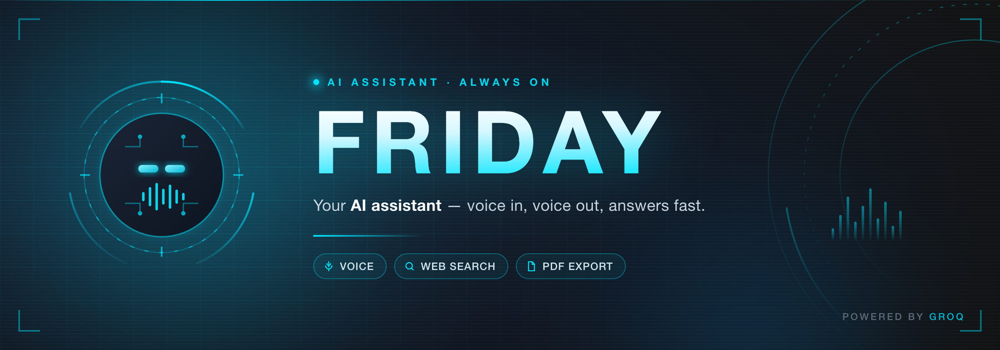

<div align="center">
  

  <p>
    
    
    
    
  </p>
</div>

# Friday AI Assistant

A modern web application featuring an AI assistant named "Friday" with a futuristic UI and voice capabilities.

## Features

- Chat with Friday, powered by advanced language models from Groq
- Voice input and output capabilities using Web Speech API and OpenAI TTS
- Web search capability for up-to-date information
- PDF generation for saving and sharing conversations
- Theme switching between dark and light modes
- Response caching for improved performance

## Available Models

| Model | ID | Best for |
|-------|----|----------|
| GPT-OSS 20B | `openai/gpt-oss-20b` | Fast, efficient responses for everyday chat (default) |
| GPT-OSS 120B | `openai/gpt-oss-120b` | Stronger reasoning for complex questions |

Both are Groq production-tier models with a 131k context window.

Set `GROQ_MODEL` in your `.env` to change the default. To add or remove models, edit
`AVAILABLE_MODELS` in [`app.py`](app.py) — the dropdown, the request validator and the
default all read from that one list.

> **Note on older models:** earlier versions offered Llama 3.1 8B Instant, Llama 3.2 11B
> Vision Preview and Llama 3.3 70B Versatile. Groq retired all three, so they were
> replaced. Check [Groq's deprecation schedule](https://console.groq.com/docs/deprecations)
> before pinning a model.

## Setup

1. Clone the repository:

   ```bash
   git clone https://github.com/gruntcode/friday-ai-assistant.git
   cd friday-ai-assistant
   ```

2. Install dependencies:

   ```bash
   pip install -r requirements.txt
   ```

3. Create a `.env` file in the root directory with your API keys:

   ```bash
   GROQ_API_KEY=your_groq_api_key_here

   # Optional — only needed for text-to-speech. Everything else works without it.
   OPENAI_API_KEY=your_openai_api_key_here

   # Optional — overrides the default model
   GROQ_MODEL=openai/gpt-oss-20b
   ```

   Only `GROQ_API_KEY` is required. Without `OPENAI_API_KEY` the app runs normally
   and the spoken-reply feature is simply unavailable.

4. Run the application:

   ```bash
   python app.py
   ```

5. Open your browser and navigate to `http://localhost:5000`

## Getting API Keys

### Groq API Key

1. Sign up for an account at [Groq Console](https://console.groq.com/)
2. Navigate to the API Keys section
3. Create a new API key
4. Copy the key and add it to your `.env` file

### OpenAI API Key (optional — text-to-speech only)

1. Sign up for an account at [OpenAI Platform](https://platform.openai.com/)
2. Navigate to the API Keys section
3. Create a new API key
4. Copy the key and add it to your `.env` file

## Usage

- **Chat**: Type your message in the input box and press Enter or click the send button
- **Voice Input**: Click the microphone button and speak your message
- **Voice Output**: Toggle the voice button in the header to enable/disable voice responses
- **Web Search**: Toggle the search button to enable web search capabilities
- **PDF Generation**: Toggle the PDF button to generate a PDF of the conversation
- **Theme Switching**: Click the theme button to switch between dark and light modes
- **Model Selection**: Choose your preferred AI model from the dropdown menu

## Project Structure

- `app.py` - Main Flask application with API endpoints
- `templates/` - HTML templates for the web interface
- `static/` - CSS, JavaScript, and static assets
- `static/audio/` - Directory for storing generated voice responses
- `static/downloads/` - Directory for storing generated PDFs
- `static/images/friday-banner.html` - Source for the README banner
- `scripts/render-banner.js` - Renders that source to `friday-banner.png`

### Regenerating the banner

The banner at the top of this README is committed as a PNG, but generated from HTML so
it stays editable. Edit `static/images/friday-banner.html`, then:

```bash
npm install --no-save playwright
node scripts/render-banner.js
```

It renders at 2x (2400x840) for crisp display on retina screens.

## Requirements

- Python 3.8+
- Groq API key
- OpenAI API key — optional, text-to-speech only
- Modern web browser with JavaScript enabled

## License

MIT License
